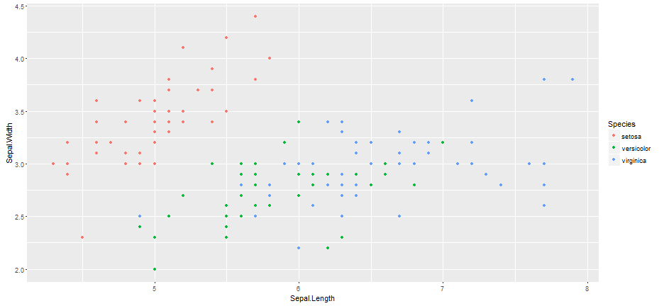

## Read-And-Delete

1. Edit YAML front matter
2. Write using R Markdown
3. Use an empty line followed by three dashes to separate slides!

--- .class #id 

## Second slide y'all

Don't really know what to say... here's a chart I guess



---

## Slide 3

What to say here
I wonder if you can use manipulate


```
## Error in manipulate(ggplot(iris, aes(Sepal.Length, Sepal.Width, color = Species, : The manipulate package must be run from within RStudio
```

---

## Slide 4

I guess not...

--- 

## Slide 5?

* This
  * should be
      * the last
          * slide
